## 👋 About Me

I'm a backend engineer based in India, focused on **cloud-native systems** and **platform engineering**. :

- **ForgeOps** — a self-hostable, Vercel-like PaaS written in Go
- **HashVault** — a cloud storage with deduplication logic

Outside of engineering, I'm building toward a long-term goal of founding a gaming and animation studio — I write horror stories, shoot photography, and I'm slowly prototyping a voxel/isometric horror game on the side.

- 🎓 BCA (9.86 CGPA), Lovely Professional University — currently pursuing MCA
- 🌱 Currently learning Java, DSA, and studying for AWS SAA
- 🎯 Next up: CKA certification

---

### 🧠 Languages & Tools

  

---

### 🚀 Flagship Projects

<table>
<tr>
<td width="50%" valign="top">

**🔧 ForgeOps**

Self-hostable, Vercel-like PaaS written in Go. Handles Git-based deploys, containerized builds with gVisor isolation, automatic TLS, and live log streaming.

`Go` `Docker` `gVisor` `PostgreSQL` `Redis` `Caddy`

- Build cache with SHA-256 content-addressed dedup
- SSE-based real-time log streaming to browser
- Prometheus/Grafana observability stack

[**→ View Repo**](https://github.com/AnkitSinha0/forgeops)

</td>
<td width="50%" valign="top">

**🗄️ HashVault**

Distributed cloud storage system in Go with content-based deduplication and resumable chunked uploads.

`Go` `PostgreSQL` `Redis` `AWS S3`

- SHA-256 deduplication engine
- Chunked, resumable file uploads
- S3-backed object storage layer

[**→ View Repo**](https://github.com/AnkitSinha0/hashvault)

</td>
</tr>
</table>

---

### 📊 Overview

  

